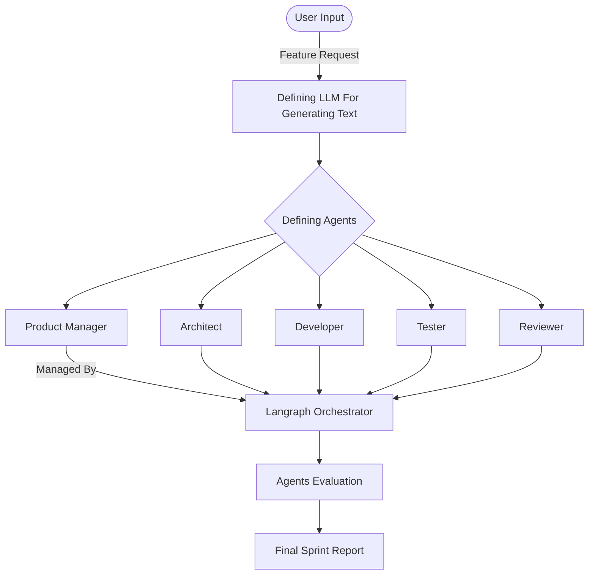

# Autonomous-Software-Engineering-Sprint-Assistant
This is an Agentic Sprint Assistant that takes a product feature request and autonomously understands it, breaks it into tasks, assigns roles, generates code, writes tests, reviews its own output and evaluates quality. This simulates a real Agile sprint cycle using AI agents.

# Project Architecture

