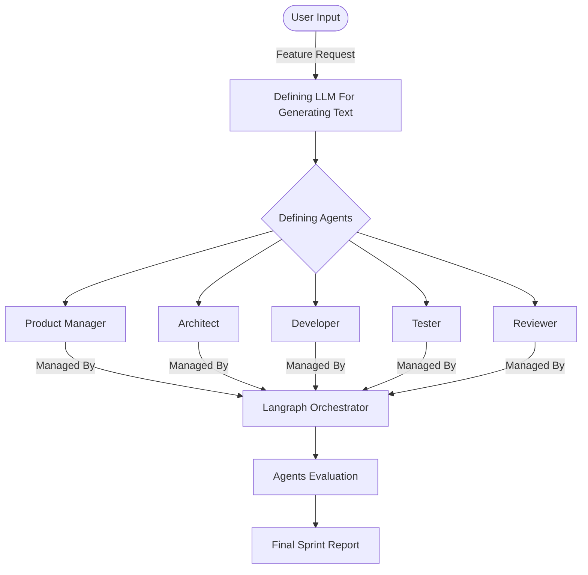

# Autonomous-Software-Engineering-Sprint-Assistant
This is an Multi-Agentic Sprint Assistant that takes a product feature request and autonomously understands it, breaks it into tasks, assigns roles, generates code, writes tests, reviews its own output and evaluates quality. This simulates a real Agile sprint cycle using AI agents.

# Project Architecture

# Evaluation Metrics
1. Code Complexity: This is cyclomatic code complexity. It measures the quality of code based on the complexity of if-else and loops.
2. Test Coverage: This measures how much test cases are generated by the LLM. More the test cases, more the coverage.
3. Semantic Similarity to Feature: This measures the similarity of generated code with the feature requested by user using an embedding model.
4. LLM Reflection Score: This measures the correctness,maintainability and completeness of the generated code on the scale of 1-10 using the LLM.

